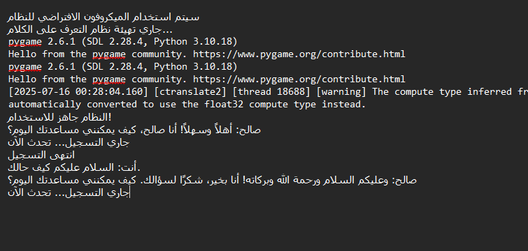

# Saleh AI - Arabic Voice Assistant

Simple Arabic voice assistant that listens, understands, and responds in Arabic.




## Quick Setup

### 1. Install Anaconda
Download from: https://www.anaconda.com/download

### 2. Install Dependencies
Open Anaconda Prompt and run:
```bash
pip install cohere RealtimeSTT gtts pygame sounddevice numpy
```

### 3. Setup API Key
- Get your Cohere API key from: https://dashboard.cohere.com/api-keys
- Replace `'YOUR_API_KEY_HERE'` in `saleh_ai.py` with your actual API key

### 4. Run
```bash
python saleh_ai.py
```

## Usage
- Wait for "جاري التسجيل... تحدث الآن"
- Speak in Arabic
- Say "وداعا" or press Ctrl+C to exit

## Requirements
- Microphone
- Internet connection
- Windows (recommended)
